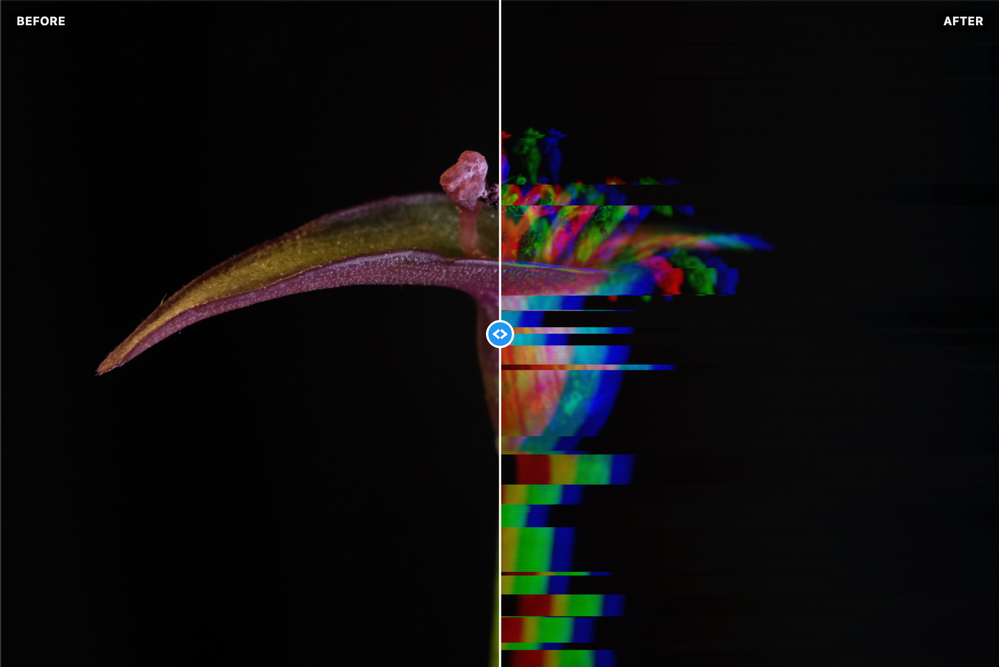
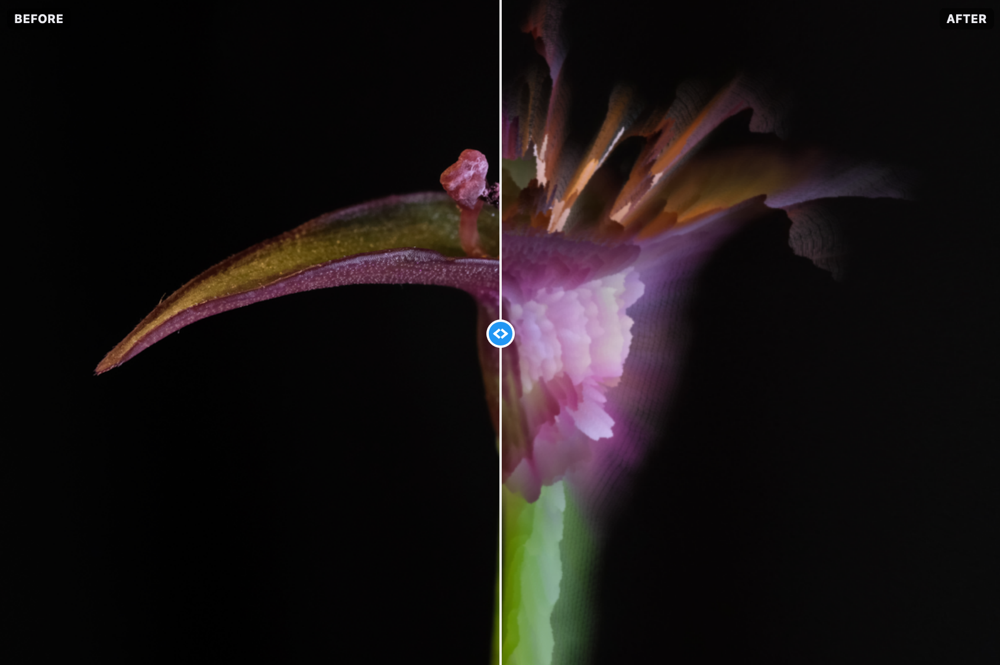

# PyEffects

A small desktop app (and CLI) for applying creative effects to your photos — with a live **before/after** preview and
a built-in **video renderer** that animates an effect over time.

## About

PyEffects is a lightweight Python toolkit for applying image effects. It ships with a reusable GUI that shows a
before/after slider and builds its settings controls **dynamically** from whichever effect is selected. Adding a new
effect only means implementing a small interface and registering it — the UI and command-line parser adapt
automatically.

It also **renders videos**: pick an effect, choose a *from → to* range for any of its variables (or several at once),
and PyEffects sweeps those values across the frames and encodes a smooth MP4 — animating, for example, the *Height*
effect ramping from 0 to 100% strength. Frames render in parallel across your CPU cores and ffmpeg smooths the motion.

Two effects ship in the box:

- **Glitch** — RGB shift, slice displacement, noise, and scanlines.
- **Glitch Height** — a radial 3D-extrusion effect: the image bursts outward from a focal point into strong,
  pointed, feathery spikes that grow toward the edges, with an optional circular frame.

### Examples

Each effect shown in the app's before/after view.

**Glitch** — RGB shift, slice displacement, and scanlines:



**Glitch Height** — radial 3D extrusion bursting from a focal point:



## Setup

### Initialize Python Environment

Create and activate a virtual environment:

```bash
python3 -m venv .venv
source .venv/bin/activate  # On Windows: .venv\Scripts\activate
```

### Install Requirements

```bash
pip install -r requirements.txt
```

> [!NOTE]
> The GUI uses [PySide6](https://doc.qt.io/qtforpython/) (Qt). On macOS the bundled Homebrew Python may not include
> Tkinter, which is why PySide6 is used instead — it installs as a self-contained wheel.

## Usage

### Desktop app (GUI)

```bash
python src/ui/app.py
```

1. Click **Open…** and choose an image.
2. Drag the **vertical divider** over the image to wipe between the original (left, *BEFORE*) and the processed result
   (right, *AFTER*).
3. Adjust the effect settings on the right — the preview updates live.
4. Below the effect settings, click **Save image…** to export the result at full resolution.
5. In the **Render video** panel below it, set the duration, frame rate, frame count, resolution (native input size by
   default, or untick to cap it), and smoothing, and use the **Transitions** rows to set a *from → to* range for any
   effect variable (by default the strength ramps 0 → 100%). Each panel has a **Reset**. Click **Render video…** to
   export the animation (a progress bar lets you cancel). Frames render in parallel across your CPU cores.

The preview is computed on a downscaled copy for responsiveness; exporting always re-renders at full resolution.

### Command line

Each effect is also runnable headless. Its options are generated from the same settings the GUI uses:

```bash
python src/effects/glitch.py path/to/image.jpg
python src/effects/glitch.py workspace/photo.jpg --rgb-shift 0.6 --slices 30 --noise 0.1 --seed 7
```

By default the result is written next to the original as `<name>_glitch.<ext>` (use `-o` to override). Run with
`--help` to see every option.

#### Glitch settings

| Setting     | CLI flag        | Description                                               | Default |
|-------------|-----------------|-----------------------------------------------------------|---------|
| RGB shift   | `--rgb-shift`   | Chromatic aberration: how far the red/blue channels slide | `0.5`   |
| Slices      | `--slices`      | Number of displaced horizontal bands                      | `20`    |
| Slice shift | `--slice-shift` | Max horizontal displacement per band (fraction of width)  | `0.10`  |
| Noise       | `--noise`       | Amount of random color speckle                            | `0.0`   |
| Scanlines   | `--scanlines`   | Strength of the darkened CRT-style scanlines              | `0.15`  |
| Seed        | `--seed`        | Random seed (same seed → same glitch)                     | `42`    |

#### Glitch Height settings

```bash
python src/effects/glitch_height.py path/to/image.jpg
python src/effects/glitch_height.py workspace/photo.jpg --strength 0.6 --center-y 0.55
```

| Setting        | CLI flag      | Description                                       | Default |
|----------------|---------------|---------------------------------------------------|---------|
| Strength       | `--strength`  | Length of the radial extrusion spikes             | `0.25`  |
| Center X       | `--center-x`  | Horizontal focal point (0 = left, 1 = right)      | `0.5`   |
| Center Y       | `--center-y`  | Vertical focal point (0 = top, 1 = bottom)        | `0.5`   |
| Detail         | `--detail`    | Number of extrusion steps (higher = smoother)     | `100`   |
| Circular frame | `--circle`    | Mask the result to a circle, fading corners black | off     |
| Scanlines      | `--scanlines` | Strength of the darkened CRT-style scanlines      | `0.0`   |

### Video (parameter sweep)

Render an MP4 that animates one of an effect's parameters from its minimum to its maximum — by default the **strength**,
ramped from 0 to 100%:

```bash
python src/render/video.py workspace/photo.jpg                 # height effect, 10s @ 30fps
python src/render/video.py workspace/photo.jpg -e height -d 15 --frames 200 --smooth motion
python src/render/video.py workspace/photo.jpg --sweep strength:0:1 --sweep center_y:0.4:0.6
```

| Option     | CLI flag        | Description                                       | Default        |
|------------|-----------------|---------------------------------------------------|----------------|
| Effect     | `-e/--effect`   | Effect id to animate (`glitch`, `height`, …)      | `height`       |
| Output     | `-o/--output`   | Output `.mp4` path                                | `<name>.mp4`   |
| Parameter  | `-p/--param`    | Parameter to sweep (when `--sweep` is not given)  | `strength`     |
| Sweep      | `--sweep`       | `NAME:FROM:TO`, repeatable — animate several vars | strength 0→max |
| Duration   | `-d/--duration` | Video length in seconds                           | `10`           |
| Frame rate | `--fps`         | Output frames per second                          | `30`           |
| Frames     | `--frames`      | Distinct frames rendered across the sweep         | `100`          |
| Max size   | `--max-size`    | Longest edge of the video in pixels               | `1024`         |
| Smoothing  | `--smooth`      | In-between frames: `blend`, `motion`, or `none`   | `blend`        |
| Workers    | `--workers`     | Frames rendered in parallel                       | CPU count      |

The frames are rendered into a folder named `_<image-stem>` next to the image, then encoded to `<image-stem>.mp4`.
Because each frame of an effect like *Height* is expensive, only `--frames` distinct frames are rendered (one per
step) — in parallel across `--workers` threads. **ffmpeg** then fills the gap up to `--fps` either by interpolating
smooth in-between frames (`--smooth blend`/`motion`) or by duplicating frames (`--smooth none`), so the video runs the
full `--duration` and stays smooth. Raise `--frames` for crisper motion (slower), lower it for a quicker render.
Encoding uses a bundled ffmpeg (`imageio-ffmpeg`) or a system `ffmpeg` if present.

## Project Structure

```
pyeffects/
├── requirements.txt
├── src/
│   ├── effects/
│   │   ├── base.py          # Effect interface + Param descriptors
│   │   ├── glitch.py        # GlitchEffect
│   │   ├── glitch_height.py # GlitchHeightEffect (radial extrusion)
│   │   └── registry.py      # list of available effects
│   ├── ui/
│   │   ├── app.py           # entry point (launches the window)
│   │   ├── main_window.py   # MainWindow: preview + sidebar + export
│   │   ├── compare.py       # before/after sliding-panel widget
│   │   ├── controls.py      # builds controls from an effect's params
│   │   ├── workers.py       # background preview/video render threads
│   │   ├── spinner.py       # busy spinner overlay
│   │   ├── widgets.py       # small widget factories / helpers
│   │   └── qt_image.py      # Pillow ↔ Qt conversion
│   ├── render/
│   │   └── video.py         # parameter-sweep video renderer (CLI + used by the GUI)
│   └── utils/               # shared helpers
│       ├── cli.py           # shared command-line runner (params → argparse)
│       ├── file.py          # file-path helpers
│       └── term.py          # terminal colors / icons
└── workspace/             # scratch space for input/output images
```

## Adding a new effect

The window is effect-agnostic. To add one:

1. Subclass `Effect` (in `src/effects/base.py`) and set `id` / `name`.
2. Return your settings from `params()` as `Param` descriptors — each becomes a slider, checkbox, or dropdown in the
   GUI and a flag in the CLI.
3. Implement `apply(image, **values)` to return the processed image.
4. Register the class in `src/effects/registry.py`.

That's it — no UI changes required. Example skeleton:

```python
from PIL import Image

from effects.base import Effect, Param, ParamKind


class InvertEffect(Effect):
    id = "invert"
    name = "Invert"

    def params(self) -> list[Param]:
        return [Param("amount", "Amount", ParamKind.FLOAT, default=1.0, min=0.0, max=1.0, step=0.01)]

    def apply(self, image: Image.Image, **values) -> Image.Image:
        v = self.merge(values)
        ...
        return result
```

## License

[MIT](LICENSE)
